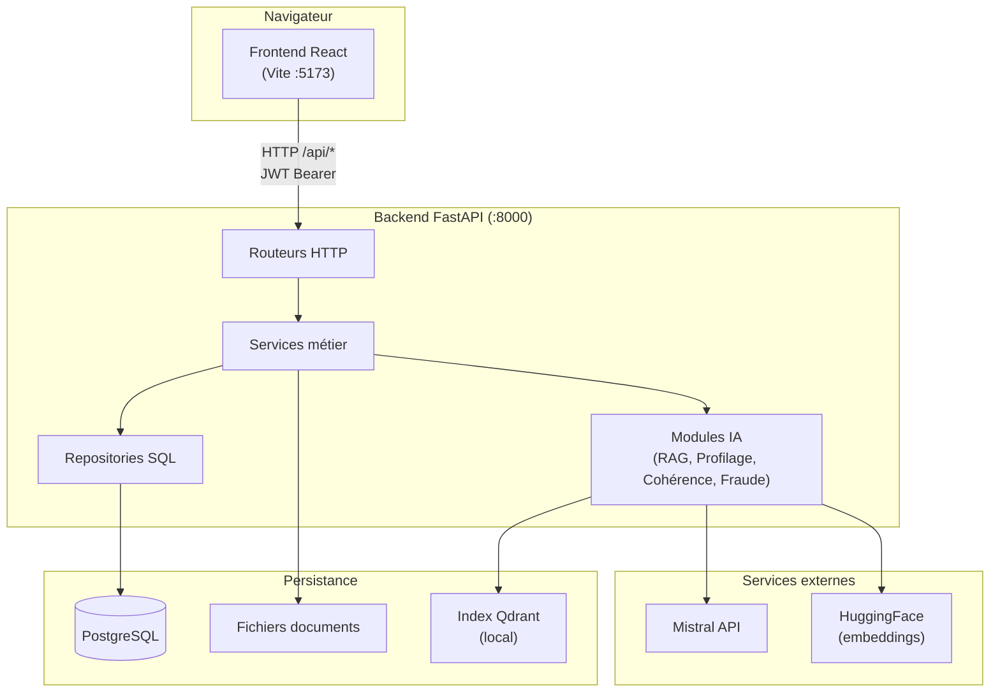
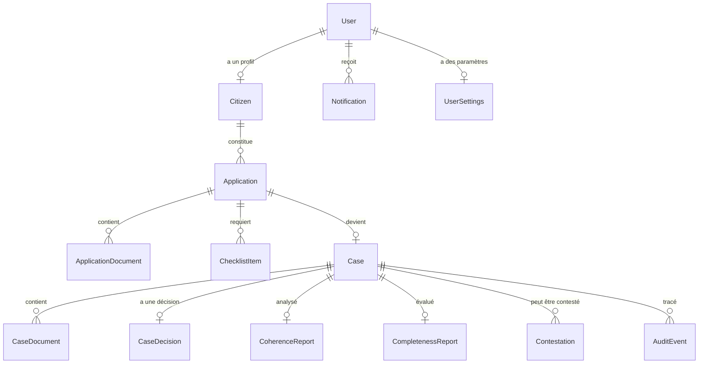

# Rapport d'analyse détaillé — MonParcours

> **Document généré le 28 juillet 2026**  
> Portail citoyen GovTech français : un compte, un profil citoyen, plusieurs services publics.

---

## Table des matières

1. [Résumé exécutif](#1-résumé-exécutif)
2. [Architecture globale](#2-architecture-globale)
3. [Stack technique](#3-stack-technique)
4. [Structure racine du dépôt](#4-structure-racine-du-dépôt)
5. [Dossier `docs/` — Documentation](#5-dossier-docs--documentation)
6. [Dossier `frontend/` — Application React](#6-dossier-frontend--application-react)
7. [Dossier `backend/` — API FastAPI](#7-dossier-backend--api-fastapi)
8. [Catalogue des endpoints API](#8-catalogue-des-endpoints-api)
9. [Modèle de données (entités principales)](#9-modèle-de-données-entités-principales)
10. [Routes frontend (URLs)](#10-routes-frontend-urls)
11. [Flux métier end-to-end](#11-flux-métier-end-to-end)
12. [Sécurité et authentification](#12-sécurité-et-authentification)
13. [Intelligence artificielle](#13-intelligence-artificielle)
14. [Tests et scripts utilitaires](#14-tests-et-scripts-utilitaires)
15. [Conventions et règles d'architecture](#15-conventions-et-règles-darchitecture)
16. [Comment étendre le projet](#16-comment-étendre-le-projet)

---

## 1. Résumé exécutif

**MonParcours** est une plateforme GovTech qui centralise les démarches administratives d'un citoyen français. Le premier service implémenté est l'**APL (Aide Personnalisée au Logement)** via la CAF ; d'autres administrations (France Travail, Ameli, Impôts) sont prévues dans le registre des services.

Le dépôt est un **monorepo** contenant deux applications indépendantes :

| Composant | Technologie | Port local | Rôle |
|-----------|-------------|------------|------|
| **Frontend** | React 18, TypeScript, Vite 6 | `:5173` | Interface citoyenne + portail agent |
| **Backend** | FastAPI, SQLAlchemy 2, PostgreSQL | `:8000` | API REST, IA, persistance |

### Fonctionnalités implémentées

- **Authentification** : inscription citoyen, login, vérification email, reset password, provisioning agents/admins
- **Profilage citoyen** : assistant IA conversationnel (LangGraph + Mistral) pour construire le profil
- **Dossier APL personnalisé** : checklist dynamique dérivée du profil, dépôt de documents, soumission
- **Assistant IA citoyen** : RAG hybride (BM25 + Qdrant + Mistral) sur corpus APL/CAF
- **Portail agent** : file d'instruction, évaluation unifiée (MonParcours Result), décisions, contestations
- **Audit immuable** : piste d'audit hash-chaînée SHA-256
- **Notifications et paramètres** : transverses aux deux portails
- **Accessibilité RGAA** : 7 préférences fonctionnelles persistées

---

## 2. Architecture globale



### Séparation des responsabilités

**Frontend** — organisation par **features isolées** :
- Un module `features/*` n'importe **jamais** depuis un autre module `features/*`
- Les services API (`services/`) et types (`types/`) sont partagés
- Code-splitting au niveau des routes (lazy loading)

**Backend** — **monolithe modulaire** :
- Chaque module suit : `router.py → service.py → repository.py → models.py / schemas.py`
- Le routeur parse la requête, le service contient les règles métier, le repository exécute le SQL
- Les modèles sont enregistrés dans `app/database/models.py` pour Alembic

---

## 3. Stack technique

### Frontend

| Catégorie | Technologie | Version | Usage |
|-----------|-------------|---------|-------|
| Framework UI | React | 18.3 | Composants, hooks |
| Langage | TypeScript | 5.7 | Typage strict |
| Build | Vite | 6.0 | Dev server, bundling |
| Styles | Tailwind CSS | 3.4 | Utility-first CSS |
| Composants | Radix UI | 1.x–2.x | Primitives accessibles (style shadcn/ui) |
| Routing | React Router | 6.28 | SPA, lazy routes |
| État global | Zustand | 5.0 | Session, UI, notifications |
| Icônes | lucide-react | 0.469 | Iconographie |

### Backend

| Catégorie | Technologie | Version | Usage |
|-----------|-------------|---------|-------|
| Framework API | FastAPI | 0.115 | REST, OpenAPI/Swagger |
| Serveur | Uvicorn | 0.34 | ASGI |
| ORM | SQLAlchemy | 2.0 | Modèles, requêtes |
| Base de données | PostgreSQL | — | Persistance relationnelle |
| Migrations | Alembic | 1.14 | Schéma versionné |
| Validation | Pydantic | 2.11 | Schémas entrée/sortie |
| Auth | python-jose, bcrypt | — | JWT HS256, hash passwords |
| Profilage IA | LangGraph | 0.2 | Graphe conversationnel |
| RAG | rank-bm25, qdrant-client, sentence-transformers | — | Recherche hybride |
| LLM | mistralai | 2.7 | Génération, OCR, analyse |
| Documents | pypdf, pdfplumber | — | Extraction texte PDF |
| Tests | pytest, httpx | — | Tests unitaires/intégration |

---

## 4. Structure racine du dépôt

```
MonParcours/
├── README.md                 # Guide de démarrage, stack, règles d'isolation
├── frontend/                 # Application React (SPA)
├── backend/                  # API FastAPI/Python
└── docs/                     # Documentation d'architecture et conception
```

| Élément | Description détaillée |
|---------|----------------------|
| `README.md` | Point d'entrée du dépôt. Décrit le démarrage frontend (`npm run dev`) et backend (`uvicorn`), la stack, la structure `frontend/src/`, la règle d'isolation des features, l'accessibilité RGAA, et comment ajouter un nouveau service public. |
| `frontend/` | Projet npm autonome. Contient `package.json`, configuration Vite/TypeScript/Tailwind, et tout le code source dans `src/`. |
| `backend/` | Projet Python autonome. Contient `requirements.txt`, Alembic, l'application dans `app/`, scripts et tests. |
| `docs/` | Documentation technique, roadmaps, revues d'architecture, schéma BDD. |

> **Note** : la racine ne contient aucun outillage de build commun. Chaque sous-projet gère ses propres dépendances.

---

## 5. Dossier `docs/` — Documentation

| Fichier | Rôle et contenu |
|---------|-----------------|
| `design-analysis.md` | Analyse des 13 maquettes UI. Extraction du design system (couleurs, typographie, espacements), décisions UX et arbitrages de conception. |
| `roadmap.md` | État actuel du projet, points d'attention, ordre de construction recommandé. |
| `roadmap-squads.md` | Planification par équipes (squads) : répartition des travaux entre équipes. |
| `IMPLEMENTATION_STATUS.md` | **Document vivant** comparant l'implémentation aux specs fonctionnelles et techniques. Historique des itérations (newest first). Décrit les corrections (RAG, dossier unifié, profilage live). |
| `ARCHITECTURE_REVIEW.md` | Revue d'architecture globale du système. |
| `frontend-architecture-review.md` | Revue spécifique de l'architecture frontend (features, routing, services). |
| `comparaison-architecture-cible.md` | Écart entre l'implémentation actuelle et l'architecture cible. |
| `schema-bdd.md` | Schéma de base de données : tables, relations, contraintes. |
| `TECH_STACK.md` | Stack technique détaillée avec justifications de choix. |
| `audit-flux-e2e.md` | Description des flux end-to-end et mécanismes d'audit. |
| `agent-decision-workflow.md` | Workflow de prise de décision par l'agent (validation, rejet, motifs). |
| `agent-portal-data-layer.md` | Couche données du portail agent : modèles, services, contrats API. |
| `agent-portal-implementation-plan.md` | Plan d'implémentation détaillé du portail agent. |
| `solution-status-and-roadmap.md` | Statut global de la solution et feuille de route. |
| `RAPPORT_ANALYSE_PROJET.md` | **Ce document** — analyse exhaustive de la structure du projet. |

---

## 6. Dossier `frontend/` — Application React

### 6.1 Fichiers de configuration (racine `frontend/`)

| Fichier | Rôle détaillé |
|---------|---------------|
| `package.json` | Métadonnées npm (`name: monparcours`, `version: 0.1.0`). Scripts : `dev` (Vite dev server), `build` (typecheck + build prod), `preview`, `typecheck`, `lint`. Liste toutes les dépendances React, Radix, Tailwind, Zustand. |
| `package-lock.json` | Verrouillage exact des versions npm pour reproductibilité. |
| `vite.config.ts` | Configuration Vite : plugin React, alias `@/` → `src/`, proxy `/api` → `http://localhost:8000` en dev. |
| `tsconfig.json` | TypeScript strict, paths `@/*`, références projet pour build. |
| `tailwind.config.ts` | Thème Tailwind : couleurs du design system (variables CSS), animations, plugins (`tailwindcss-animate`). |
| `postcss.config.js` | Pipeline PostCSS : Tailwind + Autoprefixer. |
| `index.html` | Point d'entrée HTML. Contient `<div id="root">` et charge `src/main.tsx`. |

---

### 6.2 `frontend/src/` — Point d'entrée et styles globaux

| Fichier | Rôle détaillé |
|---------|---------------|
| `main.tsx` | Point d'entrée React. Monte `<AppProviders>` puis `<AppRouter>` dans `#root` avec `StrictMode`. Importe `index.css`. |
| `index.css` | **Design tokens** en variables CSS (`--color-primary`, etc.). Classes d'accessibilité (`a11y-high-contrast`, `a11y-large-text`, `a11y-enhanced-focus`, `a11y-reduced-motion`). Directives Tailwind `@tailwind base/components/utilities`. |
| `vite-env.d.ts` | Déclarations TypeScript pour Vite (`import.meta.env`, types modules). |

---

### 6.3 `src/app/` — Composition de l'application

#### `app/config/` — Configuration globale

| Fichier | Rôle détaillé |
|---------|---------------|
| `app.ts` | Identité de l'application : nom « MonParcours », description, métadonnées affichées dans le header/footer. |
| `services.ts` | **Registre des services publics** — point d'extension de la plateforme. Contient `SERVICES[]` : CAF/APL (disponible), France Travail, Ameli, Impôts (coming soon). Chaque entrée a `id`, `name`, `administration`, `description`, `basePath`, `status`. Fonction `getService(id)`. |
| `navigation.ts` | Items de la sidebar citoyenne : liens vers portail, profil, dossier, documents, chat, paramètres. Utilise les constantes `ROUTES`. |
| `nav-item.ts` | Type TypeScript `NavItem` : `{ label, href, icon?, badge? }`. Contrat partagé pour la navigation. |

#### `app/providers/`

| Fichier | Rôle détaillé |
|---------|---------------|
| `AppProviders.tsx` | Enveloppe racine de l'application. Compose les providers nécessaires (thème, contextes futurs). Point unique pour ajouter un nouveau provider global. |

#### `app/router/` — Routage SPA

| Fichier | Rôle détaillé |
|---------|---------------|
| `index.tsx` | **Définition complète des routes** avec `createBrowserRouter`. Lazy loading de chaque page. Trois zones : (1) auth publique (`AuthLayout`), (2) onboarding profilage (`FocusLayout` + `ProtectedRoute`), (3) portail citoyen (`AppShell` + `ProtectedRoute`), (4) portail agent (`ProtectedRoute role="agent"`). Monte `agentRoutes` sous `/agent`. |
| `paths.ts` | **Source unique de vérité** pour tous les chemins URL (`ROUTES.*`). Jamais de string hardcodée ailleurs. Chemins auth synchronisés avec `backend/app/modules/auth/notifications.py`. |
| `ProtectedRoute.tsx` | Garde d'accès. Vérifie la session (Zustand `sessionStore`). Redirige vers `/login` si non authentifié. Prop `role` optionnelle : `"agent"` pour le portail agent. |
| `RouteFallback.tsx` | Composant affiché pendant le lazy loading (skeleton/spinner). Utilisé dans `<Suspense>`. |

---

### 6.4 `src/components/` — Composants réutilisables

#### `components/ui/` — Design system (style shadcn/ui)

Composants basés sur **Radix UI** + **Tailwind**, accessibles par défaut.

| Fichier | Composant | Usage |
|---------|-----------|-------|
| `accordion.tsx` | Accordéon | Sections pliables (FAQ, détails dossier) |
| `alert.tsx` | Alert | Messages d'information, avertissement, erreur |
| `avatar.tsx` | Avatar | Photo/initiales utilisateur |
| `badge.tsx` | Badge | Labels de statut, compteurs |
| `button.tsx` | Button | Boutons primaires, secondaires, ghost, destructive |
| `card.tsx` | Card | Conteneurs avec header/content/footer |
| `checkbox.tsx` | Checkbox | Cases à cocher formulaires |
| `dialog.tsx` | Dialog | Modales accessibles (focus trap) |
| `dropdown-menu.tsx` | DropdownMenu | Menus contextuels |
| `input.tsx` | Input | Champs texte, email, password |
| `label.tsx` | Label | Labels de formulaire liés aux inputs |
| `progress.tsx` | Progress | Barres de progression linéaires |
| `radio-group.tsx` | RadioGroup | Sélection exclusive |
| `select.tsx` | Select | Listes déroulantes |
| `separator.tsx` | Separator | Ligne de séparation visuelle |
| `skeleton.tsx` | Skeleton | Placeholders animés (chargement) |
| `switch.tsx` | Switch | Interrupteurs on/off (paramètres) |
| `table.tsx` | Table | Tableaux de données |
| `tabs.tsx` | Tabs | Navigation par onglets |
| `textarea.tsx` | Textarea | Zones de texte multiligne |
| `index.ts` | — | Réexport de tous les composants UI |

#### `components/layout/` — Coquilles applicatives

| Fichier | Rôle détaillé |
|---------|---------------|
| `AppShell.tsx` | Layout principal authentifié : `Header` + `Sidebar` + `<main>` + `Footer`. Détecte le portail agent vs citoyen via `isAgentPath()`. |
| `AuthLayout.tsx` | Layout minimal pour login/register : centré, sans sidebar, logo seul. |
| `FocusLayout.tsx` | Layout sans distraction pour l'onboarding profilage : pas de navigation latérale. |
| `Header.tsx` | En-tête : logo, titre page, actions (notifications, profil, déconnexion). Pastille notifications non lues. |
| `Sidebar.tsx` | Menu latéral : items de navigation (citoyen ou agent selon le contexte). `aria-current` sur l'item actif. |
| `Footer.tsx` | Pied de page : liens légaux, mentions, version. |
| `Logo.tsx` | Composant logo MonParcours (SVG ou image). |
| `SkipLink.tsx` | Lien d'évitement RGAA : « Aller au contenu principal » — visible au focus clavier. |
| `index.ts` | Réexport des layouts. |

#### `components/shared/` — Composants transverses (issus des maquettes)

| Fichier | Rôle détaillé |
|---------|---------------|
| `EmptyState.tsx` | État vide standard : icône + titre + description + action optionnelle. Utilisé quand une collection est vide (pas de données simulées). |
| `DataRow.tsx` | Ligne label/valeur. Si `value` absent → affiche « Non renseigné » (annonce accessibilité). |
| `PageHeader.tsx` | En-tête de page : titre H1, sous-titre, actions (boutons). |
| `SectionHeader.tsx` | En-tête de section dans une page : titre H2, action secondaire. |
| `StatusBadge.tsx` | Badge coloré selon statut métier (validé, en cours, rejeté…). |
| `CircularProgress.tsx` | Progression circulaire (complétude dossier). |
| `Stepper.tsx` | Indicateur d'étapes (parcours multi-étapes). |
| `Dropzone.tsx` | Zone de dépôt drag-and-drop pour fichiers. |
| `AiSuggestionCard.tsx` | Carte affichant une suggestion de l'IA (profilage, assistant). |
| `index.ts` | Réexport. |

#### `components/notifications/`

| Fichier | Rôle détaillé |
|---------|---------------|
| `NotificationList.tsx` | Liste des notifications utilisateur : titre, message, date, statut lu/non lu. Action « marquer comme lu ». |

#### `components/settings/`

| Fichier | Rôle détaillé |
|---------|---------------|
| `SettingRow.tsx` | Ligne de paramètre : label à gauche, contrôle (switch, select) à droite. Utilisé dans les pages paramètres. |

---

### 6.5 `src/features/` — Modules métier isolés

> **Règle fondamentale** : un module `features/*` n'importe **jamais** depuis un autre module `features/*`. Communication via `services/`, `types/`, `store/`.

---

#### `features/auth/` — Authentification

| Fichier | Rôle détaillé |
|---------|---------------|
| `pages/LoginPage.tsx` | Formulaire connexion (email + password). Appelle `authService.login()`. Redirige vers portail ou agent selon le rôle. |
| `pages/RegisterPage.tsx` | Inscription citoyen. Crée compte + token JWT. Redirige vers onboarding profilage. |
| `pages/ForgotPasswordPage.tsx` | Demande reset password. Envoie email (toujours 200 pour ne pas révéler l'existence du compte). |
| `pages/ResetPasswordPage.tsx` | Page publique ouverte depuis le lien email. Token dans l'URL = credential. |
| `pages/VerifyEmailPage.tsx` | Confirmation email via token reçu par courriel. |
| `components/FranceConnectButton.tsx` | Bouton FranceConnect (intégration future / placeholder UI). |

---

#### `features/portal/` — Portail citoyen (pages transverses)

| Fichier | Rôle détaillé |
|---------|---------------|
| `pages/CitizenDashboardPage.tsx` | Tableau de bord citoyen : accès rapide aux services, statut dossier, notifications récentes. |
| `pages/NotificationsPage.tsx` | Centre de notifications : liste complète, marquer lu, tout marquer lu. |
| `pages/CitizenSettingsPage.tsx` | Paramètres compte citoyen : préférences, notifications, langue. |
| `pages/NotFoundPage.tsx` | Page 404 avec lien retour accueil. |

---

#### `features/citizen/profiling/` — Profilage citoyen assisté par IA

| Fichier | Rôle détaillé |
|---------|---------------|
| `pages/ProfilePage.tsx` | Affichage et édition du profil citoyen (identité, situation, logement, ressources). |
| `pages/ProfilageOnboardingPage.tsx` | Parcours de profilage post-inscription. Assistant conversationnel question/réponse. |
| `pages/AccessibilityPreferencesPage.tsx` | 7 préférences RGAA : contraste élevé, texte agrandi, focus renforcé, animations réduites, etc. |
| `components/ProfilageOverlay.tsx` | Overlay modal du parcours de profilage (réouverture depuis n'importe quelle page). |
| `components/ProfilageAssistantPanel.tsx` | Panneau latéral de l'assistant profilage : question courante, historique, progression. |
| `components/ProfilageReopenButton.tsx` | Bouton flottant pour rouvrir le profilage. |
| `services/citizenProfileService.ts` | API profil : `GET/PATCH /citizen/profile`. |
| `services/profilageService.ts` | API sessions profilage : `POST /session/{id}/profilage/tour`. |
| `store/profilageStore.ts` | État Zustand du profilage. **Persiste chaque réponse live** vers le backend (déclenche resync checklist). |
| `types/profilage.ts` | Types : `ProfilPartiel`, `TourAgent`, `AnalyseReponse`, `ProchaineAction`. |
| `utils/accessibilityOptions.ts` | Définition des 7 options d'accessibilité (id, label, classe CSS). |
| `utils/profileSnapshot.ts` | Utilitaire pour capturer/comparer un snapshot du profil. |
| `utils/profilLabels.ts` | Libellés français des champs profil pour l'affichage. |
| `index.ts` | Réexport public du module. |

---

#### `features/documents/` — Dossier et documents citoyen

| Fichier | Rôle détaillé |
|---------|---------------|
| `pages/PersonalizedDossierPage.tsx` | **Page dossier unifiée** : état civil (NIR + date naissance) → checklist personnalisée → dépôt pièces → complétude → soumission → statut instruction → contestation. Clé sur `application.id` du citoyen connecté. |
| `pages/DocumentsPage.tsx` | Liste des documents déposés avec statut (analysé, validé, rejeté). |
| `pages/DocumentUploadPage.tsx` | Redirection vers `/mon-dossier` (legacy, conservé pour compatibilité URLs). |
| `components/DecisionContestation.tsx` | UI pour contester une décision rejetée : formulaire motif + description. |

---

#### `features/chatbot/` — Assistant IA citoyen (RAG APL)

| Fichier | Rôle détaillé |
|---------|---------------|
| `pages/ChatPage.tsx` | Page chat plein écran avec historique de conversation. |
| `components/FloatingChatbot.tsx` | Widget chatbot flottant (bouton + fenêtre) présent sur toutes les pages citoyen. |
| `components/ChatWindow.tsx` | Fenêtre de conversation : input, messages, sources. |
| `components/AssistantWidget.tsx` | Widget assistant compact intégré dans une page. |
| `components/MessageBubble.tsx` | Bulle de message (utilisateur vs assistant), formatage markdown. |
| `components/SourceCitation.tsx` | Affichage des citations sources RAG (document, extrait, score). |
| `hooks/useChatbot.ts` | Hook React : envoi message, réception réponse, gestion loading/erreur, historique. |
| `services/chatbotService.ts` | Appel API `POST /citizen/chatbot/message`. |
| `store/chatbotUiStore.ts` | État UI : ouvert/fermé, minimisé, position widget. |
| `types/chatbot.ts` | Types : `ChatMessage`, `ChatbotResponse`, `Intent`, `SourceCitation`. |
| `utils/deepLinks.ts` | Génération de liens profonds depuis le chatbot vers pages de l'app (dossier, profil…). |

---

#### `features/agent/` — Portail agent (instruction de dossiers)

##### Fichiers racine du module

| Fichier | Rôle détaillé |
|---------|---------------|
| `index.ts` | Point d'entrée : exporte `agentRoutes` pour le router principal. |
| `routes.tsx` | Table de routes agent (lazy loaded). Montée sous `/agent` par le router principal. |
| `paths.ts` | Constantes URL agent (`AGENT_ROUTES.*`), fonction `isAgentPath()`, `relativeTo()` pour react-router. |
| `config/navigation.ts` | Items sidebar portail agent : dossiers, validation, contestations, statistiques… |

##### Pages agent

| Fichier | Route | Rôle |
|---------|-------|------|
| `dashboard/pages/AgentDashboardPage.tsx` | `/agent` | Tableau de bord : compteurs charge de travail, dossiers urgents. |
| `cases/pages/CaseListPage.tsx` | `/agent/dossiers` | File d'instruction : tableau filtrable (statut, recherche, pendingDecision). |
| `cases/pages/CaseDetailPage.tsx` | `/agent/dossiers/:caseId` | Détail dossier complet : profil, documents, rapports, audit, décision. |
| `validation/pages/ValidationQueuePage.tsx` | `/agent/validation` | File de validation : dossiers prêts pour décision. |
| `validation/pages/ValidationDetailPage.tsx` | `/agent/validation/:caseId` | Panneau de décision : évaluation, preuves, choix outcome. |
| `contestations/pages/ContestationListPage.tsx` | `/agent/contestations` | Liste contestations citoyens à traiter. |
| `contestations/pages/ContestationDetailPage.tsx` | `/agent/contestations/:id` | Détail contestation : accepter/rejeter avec motif. |
| `documents/pages/DocumentReviewPage.tsx` | `/agent/pieces` | Revue de documents (classification, fraude). |
| `reports/pages/ReportsPage.tsx` | `/agent/statistiques` | Statistiques et rapports d'activité. |
| `assistant/pages/AgentAssistantPage.tsx` | `/agent/assistant` | Assistant IA pour l'agent (aide à l'instruction). |
| `profile/pages/AgentProfilePage.tsx` | `/agent/profil` | Profil de l'agent connecté. |
| `settings/pages/AgentSettingsPage.tsx` | `/agent/parametres` | Paramètres compte agent. |
| `notifications/pages/AgentNotificationsPage.tsx` | `/agent/notifications` | Notifications agent. |

##### Composants agent

| Fichier | Rôle détaillé |
|---------|---------------|
| `components/AgentPage.tsx` | Wrapper page agent : header, breadcrumbs, layout commun. |
| `components/AsyncBoundary.tsx` | Boundary React pour erreurs/chargement des ressources async (ErrorBoundary + Suspense). |
| `components/CaseQueueTable.tsx` | Tableau data-driven de la file de dossiers. |
| `components/CaseScore.tsx` | Affichage score MonParcours Result (bande high/medium/low). |
| `components/CaseStatusBadge.tsx` | Badge statut dossier (submitted, under_review, validated…). |
| `components/ProvisionalNotice.tsx` | Avis « décision provisoire » ou « en attente de pièces ». |
| `cases/components/CaseAssessmentCard.tsx` | Carte évaluation unifiée : 4 catégories (complétude, cohérence, qualité doc, vigilance) + score global. |
| `cases/components/CaseAuditCard.tsx` | Carte piste d'audit : timeline événements hash-chaînés. |
| `cases/components/CaseDocumentsCard.tsx` | Carte documents du dossier avec classification et statut fraude. |
| `cases/components/CaseFraudCard.tsx` | Carte analyse fraude : score, anomalies détectées, métadonnées EXIF. |
| `cases/components/CaseProfileCard.tsx` | Carte profil citoyen : identité (NIR masqué), situation, logement. |
| `cases/components/CaseReportsCard.tsx` | Carte rapports complétude et cohérence. |
| `validation/components/DecisionPanel.tsx` | Panneau interactif de prise de décision (valider / rejeter / demander pièces). |
| `validation/components/DecisionOutcomeCard.tsx` | Affichage résultat décision enregistrée avec explication. |

##### Hooks agent

| Fichier | Rôle détaillé |
|---------|---------------|
| `hooks/useAgentCases.ts` | Chargement liste dossiers avec filtres. Appelle `agentCaseService.list()`. |
| `hooks/useCaseAssessment.ts` | Chargement évaluation MonParcours Result pour un dossier. |
| `hooks/useCaseAuditTrail.ts` | Chargement piste d'audit d'un dossier (`/audit/case/{id}`). |
| `hooks/useCaseDecision.ts` | Soumission décision agent (`POST /agent/cases/{id}/decision`). |
| `hooks/useContestations.ts` | Chargement liste contestations agent. |
| `hooks/useContestationActions.ts` | Actions review/resolve sur une contestation. |
| `hooks/useAsyncResource.ts` | Hook générique ressource async (loading, data, error, refetch). |
| `hooks/index.ts` | Réexport hooks. |

##### Services API agent

| Fichier | Rôle détaillé |
|---------|---------------|
| `services/agentCaseService.ts` | CRUD dossiers : list, get, stats. |
| `services/agentAssessmentService.ts` | GET évaluation unifiée `/agent/cases/{id}/assessment`. |
| `services/agentAuditService.ts` | GET piste audit. |
| `services/agentContestationService.ts` | CRUD contestations côté agent. |
| `services/agentDecisionService.ts` | POST décision. |
| `services/index.ts` | Réexport. |

##### Utilitaires agent

| Fichier | Rôle détaillé |
|---------|---------------|
| `lib/casePresentation.ts` | Formatage présentation dossiers : labels statuts, couleurs, dates relatives. |

---

### 6.6 `src/hooks/` — Hooks globaux réutilisables

| Fichier | Rôle détaillé |
|---------|---------------|
| `useAccessibilityPreferences.ts` | Lit/écrit les 7 préférences a11y. Applique classes sur `<html>`. Persiste en localStorage + sync backend settings. |
| `useDocumentTitle.ts` | Met à jour `document.title` dynamiquement par page. |
| `useMediaQuery.ts` | Hook responsive : détecte breakpoints (`isMobile`, `isTablet`). |
| `useUserSettings.ts` | Charge/met à jour paramètres utilisateur via `settingsService`. |
| `index.ts` | Réexport. |

---

### 6.7 `src/services/` — Couche API (contrats HTTP)

| Fichier | Rôle détaillé |
|---------|---------------|
| `apiClient.ts` | **Client HTTP unique**. Base URL `/api` (proxy Vite en dev). Ajoute header `Authorization: Bearer`. Normalise erreurs en `ApiClientError`. Sérialise query params. Gère 401 → clear token + redirect login. |
| `authService.ts` | Login, register, verify email, reset password, get `/auth/me`. |
| `authToken.ts` | Stockage JWT en `localStorage`. `getToken()`, `setToken()`, `clearToken()`. |
| `dossierService.ts` | Dossier citoyen : checklist, status, submit, review. Endpoints `/applications/*` et `/citizen/dossier`. |
| `documentService.ts` | Upload, list, delete, download documents. Classification. |
| `contestationService.ts` | Créer contestation citoyen, lister mes contestations. |
| `notificationService.ts` | List, unread count, mark read, mark all read. |
| `settingsService.ts` | GET/PATCH `/settings`. |
| `portalService.ts` | Données agrégées portail citoyen (dashboard). |
| `index.ts` | Réexport. |

---

### 6.8 `src/store/` — État global Zustand

| Fichier | Rôle détaillé |
|---------|---------------|
| `sessionStore.ts` | Session utilisateur : `user`, `token`, `isAuthenticated`, `role` (citizen/agent/admin). Actions login/logout. |
| `uiStore.ts` | État UI global : sidebar ouverte/fermée, thème. |
| `notificationStore.ts` | Cache notifications en mémoire + compteur non lues (sync avec API). |
| `index.ts` | Réexport. |

---

### 6.9 `src/types/` — Types TypeScript partagés

| Fichier | Types principaux |
|---------|-----------------|
| `auth.ts` | `User`, `LoginRequest`, `TokenResponse`, `UserRole` |
| `case.ts` | `CaseSummary`, `CaseDetail`, `CaseStatus`, `CaseDecision`, `MonParcoursResult` — **contrat backend agent** |
| `chat.ts` | Types messages chat génériques |
| `common.ts` | `ApiError`, `PaginatedResponse`, utilitaires |
| `contestation.ts` | `Contestation`, `ContestationStatus`, `ContestationCreateRequest` |
| `document.ts` | `CitizenDocument`, `DocumentClassification`, `DocumentStatus` |
| `dossier.ts` | `PersonalizedDossier`, `ChecklistItem`, `ApplicationStatus` |
| `notification.ts` | `Notification`, `NotificationListResponse` |
| `profile.ts` | `CitizenProfile`, `ServiceDefinition` |
| `settings.ts` | `UserSettings`, `UserSettingsUpdate` |
| `index.ts` | Réexport. |

---

### 6.10 `src/lib/`

| Fichier | Rôle détaillé |
|---------|---------------|
| `utils.ts` | Fonction `cn()` : merge classes Tailwind avec `clsx` + `tailwind-merge`. Utilitaire général. |

---

## 7. Dossier `backend/` — API FastAPI

### 7.1 Fichiers de configuration (racine `backend/`)

| Fichier | Rôle détaillé |
|---------|---------------|
| `requirements.txt` | Dépendances Python verrouillées : FastAPI, SQLAlchemy, Alembic, LangGraph, Mistral, RAG (BM25, Qdrant, sentence-transformers), auth (JWT, bcrypt), tests (pytest). |
| `README.md` | Guide démarrage : venv, `.env`, PostgreSQL, migrations, seed, uvicorn. Structure modules, contrat frontend. |
| `.env.example` | Modèle variables : `DATABASE_*`, `JWT_SECRET_KEY`, `MISTRAL_API_KEY`, `CORS_ORIGINS`, etc. |
| `alembic.ini` | Config Alembic : chemin migrations, URL base (lue depuis env). |

---

### 7.2 `backend/app/` — Application principale

#### Point d'entrée

| Fichier | Rôle détaillé |
|---------|---------------|
| `main.py` | **Composition FastAPI** : CORS, lifespan (vérif PostgreSQL + warmup RAG en thread daemon), exception handler `DomainError`, montage de tous les routeurs sous `/api`, endpoint `/api/health`. |
| `__init__.py` | Package Python. |

---

#### `app/core/` — Infrastructure transversale

| Fichier | Rôle détaillé |
|---------|---------------|
| `config.py` | **Settings Pydantic** (`pydantic-settings`). Lit `backend/.env`. Variables : DB, JWT, email (console/SMTP), CORS, Mistral API key, timeouts RAG, frontend URL. Échec à l'import si credential manquant. |
| `security.py` | Masquage NIR (affiche `***` + 2 derniers chiffres). Emplacement du garde d'auth transversal. |
| `exceptions.py` | `DomainError` : erreurs métier avec code + status HTTP. Handler → enveloppe `ApiError` attendue par le frontend. |
| `email.py` | Interface envoi email. Backend `console` (log) par défaut, `smtp` en prod. Emails vérification et reset password. |
| `logger.py` | Configuration logging structuré. |

---

#### `app/database/` — Couche persistance

| Fichier | Rôle détaillé |
|---------|---------------|
| `base.py` | `DeclarativeBase` SQLAlchemy + `TimestampMixin` (`created_at`, `updated_at` auto). |
| `session.py` | Engine PostgreSQL, factory `SessionLocal`, dependency `get_db()` (session par requête), `verify_connection()`, `check_health()`. |
| `models.py` | **Registre central Alembic**. Importe TOUS les modèles de tous les modules. Obligatoire pour autogenerate — sinon Alembic génère des migrations qui suppriment des tables. |

---

#### `app/modules/` — Modules métier

Chaque module suit le pattern :

```
modules/<nom>/
├── router.py       # HTTP uniquement — parse requête, appelle service, retourne réponse
├── service.py      # Règles métier, orchestration — AUCUN SQL
├── repository.py   # Requêtes SQLAlchemy — AUCUNE règle métier
├── models.py       # Entités SQLAlchemy persistées
├── schemas.py      # DTOs Pydantic entrée/sortie (camelCase pour le frontend)
└── __init__.py
```

---

##### `modules/auth/` — Authentification et autorisation

| Fichier | Rôle détaillé |
|---------|---------------|
| `router.py` | Endpoints : register, login, me, verify-email, resend, password-reset. Sous-routeur `staff_router` (ADMIN) : provision/list agents. |
| `service.py` | Logique : création compte, hash password, émission JWT, vérification email, reset password. Ne révèle jamais si un email existe (reset). |
| `repository.py` | CRUD `User`, `AuthToken` en base. |
| `models.py` | `User` (email, password_hash, role: citizen/agent/admin, email_verified). `AuthToken` (verification/reset tokens). |
| `schemas.py` | `LoginRequest`, `RegisterRequest`, `TokenResponse`, `UserResponse`, etc. |
| `security.py` | Hash/verify password (bcrypt). Création/décodage JWT HS256. |
| `tokens.py` | Génération tokens email verification et password reset avec TTL. |
| `dependencies.py` | FastAPI dependencies : `get_current_user`, `get_current_user_optional`, `require_citizen`, `require_agent`, `require_admin`. |
| `notifications.py` | Construction URLs frontend pour emails (chemins synchronisés avec `frontend/src/app/router/paths.ts`). |

---

##### `modules/citizen/` — Espace citoyen (pre-Case)

| Fichier | Rôle détaillé |
|---------|---------------|
| `router.py` | Endpoints documents, checklist, status, submit, review, profil citoyen, dossier personnalisé. |
| `service.py` | Orchestration upload, classification, complétude. |
| `repository.py` | Requêtes `Application`, `ApplicationDocument`, `ChecklistItem`. |
| `models.py` | `Application` (dossier citoyen), `ApplicationDocument` (fichier uploadé), `ChecklistItem` (pièce requise). Enums : `ApplicationStatus`, `DocumentStatus`, `DocumentCategory`. |
| `schemas.py` | DTOs : `CitizenDocumentSchema`, `PersonalizedChecklistSchema`, `PersonalizedDossierSchema`. |
| `profile.py` | GET/PATCH profil citoyen connecté. Masquage NIR. Résolution `Citizen` depuis token. |
| `dossier.py` | Génération dossier personnalisé. Sync checklist quand profil change (`_resync_dossier`). |
| `checklist.py` | Orchestration génération checklist. |
| `checklist_rules.py` | **Règles déterministes** checklist APL. Entrée : profil partiel. Sortie : liste pièces avec motifs. Source unique de vérité — pas de duplication. |
| `classification.py` | Classification document uploadé vs items checklist (Mistral). |
| `extraction.py` | Extraction texte PDF (native ou OCR Mistral). |
| `storage.py` | Stockage fichiers sur disque (UUID, pas de path traversal). |
| `submission.py` | Soumission dossier → création `Case` agent. Pont citoyen→agent. Idempotent. |

---

##### `modules/agent/` — Portail agent (instruction)

| Fichier | Rôle détaillé |
|---------|---------------|
| `router.py` | Endpoints protégés `require_agent` : stats, list cases, get case, assessment, decision. |
| `service.py` | Règles métier instruction. `UNDECIDED_STATUSES` partagé entre file et compteurs. Décision : outcome client, preuves/explication dérivées serveur. |
| `repository.py` | Requêtes `Case` et agrégats associés. |
| `models.py` | `Case`, `CaseDocument`, `CaseDecision`, `Citizen`, `CoherenceReport`, `CompletenessReport`, `DecisionEvidence`, etc. Enums : `CaseStatus`, `CaseScoreBand`. |
| `schemas.py` | DTOs camelCase miroir de `frontend/src/types/case.ts`. |
| `assessment.py` | **MonParcours Result** : score global déterministe (complétude 35%, cohérence 30%, qualité doc 20%, vigilance 15%). 4 catégories avec preuves et actions recommandées. |
| `evidence.py` | Agrégation preuves dossier pour la décision. |

---

##### `modules/contestation/` — Droit de contestation

| Fichier | Rôle détaillé |
|---------|---------------|
| `router.py` | Routes citoyen (`require_citizen`) : create, `/my`. Routes agent (`require_agent`) : list, get, review, resolve. |
| `service.py` | Workflow : PENDING → UNDER_REVIEW → ACCEPTED/REJECTED. Vérifie ownership dossier. Écrit audit + notification. |
| `repository.py` | CRUD `Contestation`. |
| `models.py` | `Contestation` : application_number, reason, description, status, resolution. |
| `schemas.py` | DTOs create/resolve. |

---

##### `modules/audit/` — Traçabilité immuable

| Fichier | Rôle détaillé |
|---------|---------------|
| `router.py` | Read-only. Agent : trail par entité. Admin : verify chain, recent events. |
| `service.py` | Écriture événements **atomique** avec l'action métier. Chaîne SHA-256 : chaque event contient hash du précédent. `verify_chain()` détecte altération. |
| `models.py` | `AuditEvent` : entity_type, entity_id, action, actor, payload JSON, previous_hash, hash. |
| `schemas.py` | `AuditEventSchema`, `AuditTrailResponse`, `ChainIntegrityResponse`. |

---

##### `modules/notifications/` — Notifications

| Fichier | Rôle détaillé |
|---------|---------------|
| `router.py` | Endpoints transverses (`get_current_user`) : list, unread-count, mark read, mark all read. |
| `service.py` | Création notifications (soumission, décision, contestation). Filtre par `user_id`. |
| `models.py` | `Notification` : user_id, title, message, read, link. |
| `schemas.py` | DTOs list/count/response. |

---

##### `modules/settings/` — Paramètres utilisateur

| Fichier | Rôle détaillé |
|---------|---------------|
| `router.py` | GET/PATCH settings (transverse, scopé par user). |
| `service.py` | get_or_create, update partiel. |
| `models.py` | `UserSettings` : préférences JSON (a11y, notifications, langue). |
| `schemas.py` | DTOs. |

---

##### `modules/chatbot/` — Assistant IA citoyen

| Fichier | Rôle détaillé |
|---------|---------------|
| `router.py` | `POST /citizen/chatbot/message`. Auth optionnelle (questions générales sans login). |
| `service.py` | Routage intent : `rag_general` (RAG APL), `dossier` (workflow MonParcours), fallback gracieux. |
| `schemas.py` | `ChatbotRequestSchema`, `ChatbotResponseSchema` (message, intent, sources). |

**`chatbot/rag/`** — Pipeline RAG hybride

| Fichier | Rôle détaillé |
|---------|---------------|
| `orchestrator.py` | Singleton lazy du pipeline RAG. Warmup au startup (thread daemon). |
| `rag_pipeline.py` | Pipeline principal. BM25 toujours actif. Index sémantique optionnel, time-boxé (25s). Fallback BM25-only si modèle embeddings indisponible. |
| `hybrid_search.py` | Fusion scores BM25 + sémantique (RRF ou weighted). |
| `bm25_index.py` | Index BM25 pur Python (`rank-bm25`). Pas de download. |
| `qdrant_index.py` | Index vectoriel Qdrant local (SQLite backend). |
| `chunking.py` | Découpage documents en chunks pour indexation. |
| `build_pipeline.py` | Script construction index depuis corpus. |
| `llm_client.py` | Client Mistral pour génération réponse grounded. |
| `diagnose_retrieval.py` | Outil diagnostic qualité retrieval. |

**`chatbot/rag/extraction/`** — Corpus source APL/CAF

| Fichier | Rôle |
|---------|------|
| `extract_faq.py` | Extraction FAQ APL depuis HTML |
| `extract_caf_etapes.py` | Extraction étapes démarche CAF |
| `extract_document_caf.py` | Extraction liste documents requis |
| `extract_infographie.py` | Extraction infographie APL |
| `apl.html`, `caf_etapes.html`, `document_apl.html` | Sources HTML brutes |
| `*.json` | Données extraites structurées |

**`chatbot/rag/data/chunks/`** — Chunks indexés (JSON prêts pour BM25/Qdrant)

---

##### `modules/profiling/` — Assistant profilage (LangGraph)

| Fichier / Dossier | Rôle détaillé |
|-------------------|---------------|
| `routers/profilage.py` | `POST /session/{id}/profilage/tour` — tour conversationnel. |
| `routers/session.py` | Création/récupération session profilage. |
| `services/agent_graph.py` | Graphe LangGraph : nœuds question, validation, complétude. |
| `services/llm.py` | Appels Mistral pour génération questions adaptatives. |
| `services/coercion.py` | Analyse réponse citoyen : valide, clarification, hors sujet. |
| `services/completude.py` | Calcul % complétude profil. |
| `services/knowledge.py` | Base connaissances champs profil APL. |
| `services/harness.py` | Orchestration tour : garde-fous + LLM + limite tours (`LIMITE_TOURS`). |
| `repositories/session_store.py` | Store sessions in-memory avec TTL 30 min. |
| `models/session.py` | Modèle session : profil partiel, question en attente, historique. |
| `schemas/profil.py` | `ProfilPartiel` : tous les champs profil citoyen. |
| `schemas/agent.py` | `TourAgent`, `AnalyseReponse`, `TourResponse`, enums actions. |

---

##### `modules/ai/` — Services IA transverses

**`ai/coherence/`** — Analyse cohérence dossier

| Fichier | Rôle |
|---------|------|
| `router.py` | Endpoint analyse cohérence |
| `service.py` | Compare profil vs documents déposés. Détecte anomalies. |
| `mistral_client.py` | Client Mistral spécialisé cohérence |
| `schemas.py` | `CoherenceReport`, score, explications |

**`ai/fraud/`** — Détection fraude documents

| Fichier | Rôle |
|---------|------|
| `service.py` | Analyse fraude multi-signaux |
| `llm_analyzer.py` | Analyse contenu document par LLM |
| `metadata.py` | Analyse métadonnées EXIF/PDF (dates incohérentes, éditeur suspect) |
| `schemas.py` | `FraudReport`, score vigilance |

**`ai/checklist/`** — Checklist assistée Mistral

| Fichier | Rôle |
|---------|------|
| `service.py` | Enrichissement checklist via Mistral (complément règles déterministes) |
| `mistral_client.py` | Client Mistral checklist |

**`ai/explanation.py`** — Génération explications IA génériques pour l'agent.

---

#### `app/utils/`

| Fichier | Rôle |
|---------|------|
| `__init__.py` | Utilitaires partagés (placeholder, extensions futures). |

---

### 7.3 `backend/alembic/` — Migrations base de données

| Fichier | Rôle |
|---------|------|
| `env.py` | Configuration runtime Alembic. Importe `app.database.models` pour metadata complète. |
| `script.py.mako` | Template génération fichiers migration. |

**Migrations (`versions/`)** — historique du schéma :

| Migration | Description |
|-----------|-------------|
| `20260722_1654_initial_schema` | Schéma initial (cases, citizens) |
| `20260723_0932_citizen_documents_applications` | Tables Application, ApplicationDocument, ChecklistItem |
| `20260723_1050_citizen_documents_fraud_analysis_columns` | Colonnes analyse fraude sur documents |
| `20260723_1110_move_fraud_analysis_from_application` | Refactoring : fraude sur document, pas application |
| `20260723_1150_auth_users_table` | Table User + AuthToken |
| `20260723_1210_coherence_report_score_explanation` | Rapport cohérence avec score et explication |
| `20260724_1134_auth_email_verification_and_password` | Tokens vérification email et reset password |
| `20260724_1203_citizens_user_id_fk_and_living_profile` | FK User→Citizen, profil vivant JSONB |
| `20260725_1439_notifications_table` | Table Notification |
| `20260725_1706_user_settings_table` | Table UserSettings |
| `20260726_1000_audit_events_table` | Table AuditEvent hash-chaînée |
| `20260726_1200_contestations_table` | Table Contestation |
| `20260726_1400_checklist_audit_actions` | Actions audit checklist |
| `20260726_1600_case_assessment` | Stockage MonParcours Result |
| `20260727_1758_application_document_content_hash` | Hash SHA-256 contenu documents |
| `20260727_2229_checklist_profile_hash_for_mistral` | Hash profil pour invalidation checklist Mistral |

---

### 7.4 `backend/scripts/` — Scripts utilitaires

| Fichier | Rôle détaillé |
|---------|---------------|
| `seed.py` | **Données de démonstration synthétiques**. Crée citoyens, dossiers, cases, documents. Identités inventées, emails `.test`. ⚠️ Ne jamais charger en prod. |
| `seed_users.py` | Création utilisateurs de test (citoyen, agent, admin) avec mots de passe connus. |
| `bootstrap.py` | Initialisation environnement (DB, migrations, seed). |
| `load_test_data.py` | Chargement données volumineuses pour tests de charge. |

---

### 7.5 `backend/tests/` — Tests automatisés

| Fichier | Couverture |
|---------|-----------|
| `test_auth.py` | Register, login, verify email, reset password, guards rôles |
| `test_citizen_documents.py` | Upload, classification, checklist, soumission |
| `test_checklist_rules.py` | Règles déterministes checklist (profils → pièces) |
| `test_coherence.py` | Analyse cohérence profil/documents |
| `test_fraud.py` | Détection fraude métadonnées et contenu |
| `test_assessment.py` | MonParcours Result, scores, catégories |
| `test_evidence.py` | Agrégation preuves décision |
| `test_contestation.py` | Workflow contestation citoyen→agent |
| `test_audit.py` | Chaîne hash, intégrité, écriture événements |
| `test_profilage.py` | Tours profilage, coercion, complétude |
| `test_security.py` | Masquage NIR, refus accès non autorisé |
| `__init__.py` | Package tests |

---

## 8. Catalogue des endpoints API

Base URL : `http://localhost:8000/api`

### Santé

| Méthode | Chemin | Auth | Description |
|---------|--------|------|-------------|
| GET | `/health` | — | Liveness + PostgreSQL (503 si DB injoignable) |

### Authentification (`/auth`)

| Méthode | Chemin | Auth | Description |
|---------|--------|------|-------------|
| POST | `/auth/register` | — | Créer compte citoyen + JWT |
| POST | `/auth/login` | — | Connexion (citoyen ou agent) |
| GET | `/auth/me` | User | Profil utilisateur connecté |
| POST | `/auth/verify-email` | — | Confirmer email (token = credential) |
| POST | `/auth/verify-email/resend` | User | Renvoyer email confirmation |
| POST | `/auth/password-reset/request` | — | Demander reset (toujours 200) |
| POST | `/auth/password-reset` | — | Définir nouveau password |
| POST | `/auth/staff` | Admin | Provisionner agent/admin |
| GET | `/auth/staff` | Admin | Lister comptes staff |

### Citoyen — Documents et dossier

| Méthode | Chemin | Auth | Description |
|---------|--------|------|-------------|
| GET | `/documents` | — | Liste documents (query `applicationId`) |
| POST | `/documents` | — | Upload document |
| DELETE | `/documents/{id}` | — | Supprimer document |
| GET | `/documents/{id}/classification` | — | Classification document |
| GET | `/documents/{id}/download` | — | Télécharger/prévisualiser |
| GET | `/applications/{id}/checklist` | — | Checklist personnalisée |
| GET | `/applications/{id}/status` | — | Complétude dossier |
| POST | `/applications/{id}/submit` | User | Soumettre dossier → Case |
| GET | `/applications/{id}/review` | — | Statut instruction (vue citoyen) |
| GET | `/citizen/profile` | Citizen | Profil connecté (NIR masqué) |
| PATCH | `/citizen/profile` | Citizen | Mise à jour partielle profil |
| GET | `/citizen/dossier` | Citizen | Dossier personnalisé complet |

### Chatbot

| Méthode | Chemin | Auth | Description |
|---------|--------|------|-------------|
| POST | `/citizen/chatbot/message` | Optional | Question assistant RAG APL |

### Profilage

| Méthode | Chemin | Auth | Description |
|---------|--------|------|-------------|
| POST | `/session/{id}/profilage/tour` | — | Tour conversationnel profilage |

### Agent (`/agent`) — protégé `require_agent`

| Méthode | Chemin | Description |
|---------|--------|-------------|
| GET | `/agent/cases/stats` | Compteurs charge de travail |
| GET | `/agent/cases` | File instruction (filtres: status, search, pendingDecision) |
| GET | `/agent/cases/{id}` | Détail dossier complet |
| GET | `/agent/cases/{id}/assessment` | MonParcours Result |
| POST | `/agent/cases/{id}/decision` | Enregistrer décision |

### Contestations (`/contestations`)

| Méthode | Chemin | Auth | Description |
|---------|--------|------|-------------|
| POST | `/contestations` | Citizen | Contester une décision |
| GET | `/contestations/my` | Citizen | Mes contestations |
| GET | `/contestations` | Agent | File contestations |
| GET | `/contestations/{id}` | Agent | Détail contestation |
| PATCH | `/contestations/{id}/review` | Agent | Prendre en examen |
| PATCH | `/contestations/{id}/resolve` | Agent | Résoudre (accepter/rejeter) |

### Audit (`/audit`)

| Méthode | Chemin | Auth | Description |
|---------|--------|------|-------------|
| GET | `/audit/verify` | Admin | Vérifier intégrité chaîne SHA-256 |
| GET | `/audit/recent` | Admin | Événements récents |
| GET | `/audit/{type}/{id}` | Agent | Journal audit entité |

### Notifications et Settings

| Méthode | Chemin | Auth | Description |
|---------|--------|------|-------------|
| GET | `/notifications` | User | Mes notifications |
| GET | `/notifications/unread-count` | User | Compteur non lues |
| POST | `/notifications/{id}/read` | User | Marquer lue |
| POST | `/notifications/read-all` | User | Tout marquer lu |
| GET | `/settings` | User | Mes paramètres |
| PATCH | `/settings` | User | Mettre à jour paramètres |

---

## 9. Modèle de données (entités principales)



### Tables principales

| Table | Module | Description |
|-------|--------|-------------|
| `users` | auth | Comptes (citizen, agent, admin) |
| `auth_tokens` | auth | Tokens vérification email / reset password |
| `citizens` | agent | Profil citoyen (identité, profil vivant JSONB) |
| `applications` | citizen | Dossier citoyen en construction |
| `application_documents` | citizen | Fichiers uploadés + classification + fraude |
| `checklist_items` | citizen | Pièces requises par dossier |
| `cases` | agent | Dossier agent (post-soumission) |
| `case_documents` | agent | Documents du dossier agent |
| `case_decisions` | agent | Décisions agent (validated/rejected/awaiting_documents) |
| `coherence_reports` | agent | Rapports cohérence IA |
| `completeness_reports` | agent | Rapports complétude |
| `decision_evidence` | agent | Preuves attachées à une décision |
| `contestations` | contestation | Contestations citoyens |
| `audit_events` | audit | Événements hash-chaînés SHA-256 |
| `notifications` | notifications | Notifications utilisateur |
| `user_settings` | settings | Préférences JSON par utilisateur |

---

## 10. Routes frontend (URLs)

### Authentification (publique)

| Chemin | Page | Description |
|--------|------|-------------|
| `/login` | LoginPage | Connexion |
| `/register` | RegisterPage | Inscription |
| `/mot-de-passe-oublie` | ForgotPasswordPage | Demande reset |
| `/reinitialiser-mot-de-passe` | ResetPasswordPage | Reset (lien email) |
| `/verifier-email` | VerifyEmailPage | Vérification email |

### Citoyen (authentifié)

| Chemin | Page | Description |
|--------|------|-------------|
| `/portal` | CitizenDashboardPage | Tableau de bord |
| `/portal/notifications` | NotificationsPage | Notifications |
| `/onboarding/profilage` | ProfilageOnboardingPage | Profilage post-inscription |
| `/profile` | ProfilePage | Mon profil |
| `/profile/accessibilite` | AccessibilityPreferencesPage | Préférences a11y |
| `/parametres` | CitizenSettingsPage | Paramètres |
| `/mon-dossier` | PersonalizedDossierPage | Dossier APL unifié |
| `/documents` | DocumentsPage | Liste documents |
| `/documents/depot` | DocumentUploadPage | → redirect `/mon-dossier` |
| `/chat` | ChatPage | Assistant IA |

### Agent (authentifié, rôle agent)

| Chemin | Page | Description |
|--------|------|-------------|
| `/agent` | AgentDashboardPage | Tableau de bord agent |
| `/agent/dossiers` | CaseListPage | File instruction |
| `/agent/dossiers/:caseId` | CaseDetailPage | Détail dossier |
| `/agent/validation` | ValidationQueuePage | File validation |
| `/agent/validation/:caseId` | ValidationDetailPage | Décision |
| `/agent/contestations` | ContestationListPage | Contestations |
| `/agent/contestations/:id` | ContestationDetailPage | Détail contestation |
| `/agent/pieces` | DocumentReviewPage | Revue documents |
| `/agent/statistiques` | ReportsPage | Statistiques |
| `/agent/assistant` | AgentAssistantPage | Assistant agent |
| `/agent/profil` | AgentProfilePage | Profil agent |
| `/agent/parametres` | AgentSettingsPage | Paramètres agent |
| `/agent/notifications` | AgentNotificationsPage | Notifications agent |

---

## 11. Flux métier end-to-end

### Parcours citoyen complet

```
1. Inscription (/register)
   └→ JWT émis → redirect /onboarding/profilage

2. Profilage IA (POST /session/{id}/profilage/tour)
   └→ Réponses persistées live → profil DB mis à jour
   └→ Checklist régénérée automatiquement

3. Dossier (/mon-dossier)
   └→ Saisie NIR + date naissance (PATCH /citizen/profile)
   └→ Checklist personnalisée affichée (GET /citizen/dossier)
   └→ Dépôt documents (POST /documents)
       └→ Extraction texte → Classification → Mise à jour complétude
   └→ Soumission (POST /applications/{id}/submit)
       └→ Case créé côté agent
       └→ Notification citoyen + agent
       └→ Audit event écrit

4. Instruction (côté agent)
   └→ Analyse cohérence + fraude (background)
   └→ MonParcours Result calculé
   └→ Agent décide (POST /agent/cases/{id}/decision)
       └→ Notification citoyen
       └→ Audit event

5. Contestation (si rejet)
   └→ Citoyen conteste (POST /contestations)
   └→ Agent examine et résout
   └→ Audit + notification
```

### Assistant IA citoyen

```
Question citoyen
  └→ service.answer_question()
      ├→ Intent "rag_general" → RAG hybride (BM25 + Qdrant) → Mistral génère réponse + citations
      ├→ Intent "dossier" → Workflow MonParcours (statut dossier du citoyen connecté)
      └→ Fallback → Message indisponibilité gracieux
```

---

## 12. Sécurité et authentification

| Aspect | Implémentation |
|--------|---------------|
| **Tokens** | JWT HS256, durée 30 min, secret configurable |
| **Passwords** | bcrypt hash |
| **Rôles** | `citizen`, `agent`, `admin` — guards FastAPI dependencies |
| **NIR** | Jamais renvoyé en clair — masqué (`***XX`) |
| **Reset password** | Toujours HTTP 200 (ne révèle pas existence compte) |
| **Audit** | Chaîne SHA-256 immuable, write-only depuis domain flows |
| **Documents** | Stockage UUID, pas de path traversal |
| **CORS** | Origines configurables (`CORS_ORIGINS`) |

Guards backend :
- `get_current_user` — tout utilisateur authentifié
- `require_citizen` — citoyen uniquement (403 pour agent)
- `require_agent` — agent ou admin (403 pour citoyen)
- `require_admin` — admin uniquement

---

## 13. Intelligence artificielle

| Composant | Technologie | Rôle |
|-----------|-------------|------|
| **RAG citoyen** | BM25 + Qdrant + Mistral | Réponses grounded sur corpus APL/CAF avec citations |
| **Profilage** | LangGraph + Mistral | Questions adaptatives, validation réponses |
| **Cohérence** | Mistral | Détection incohérences profil/documents |
| **Fraude** | Mistral + métadonnées | Analyse contenu + EXIF/PDF |
| **Checklist IA** | Mistral | Enrichissement (complément règles déterministes) |
| **OCR** | Mistral | Extraction texte PDF scannés |
| **MonParcours Result** | Déterministe | Score calculé (pas de décision IA) |

Principe : **l'IA assiste, l'humain décide**. Aucune décision d'éligibilité automatique.

---

## 14. Tests et scripts utilitaires

### Lancer les tests backend

```bash
cd backend
.venv/Scripts/activate
pytest
```

### Seed données de démo

```bash
cd backend
.venv/Scripts/python -m scripts.seed
```

### Frontend typecheck + build

```bash
cd frontend
npm run typecheck
npm run build
```

---

## 15. Conventions et règles d'architecture

### Frontend

1. **Isolation features** : `features/A` n'importe jamais `features/B`
2. **Chemins centralisés** : toujours `ROUTES.*` ou `AGENT_ROUTES.*`
3. **API unique** : jamais de `fetch` direct — toujours via `apiClient`
4. **États vides** : pas de données simulées — `<EmptyState />` si collection vide
5. **Accessibilité** : RGAA — skip link, focus visible, sémantique, 44px touch targets
6. **Code-splitting** : lazy import à chaque route

### Backend

1. **Couches strictes** : router → service → repository
2. **Règles métier** : uniquement dans `service.py`
3. **Réponses camelCase** : miroir exact des types TypeScript frontend
4. **Modèles enregistrés** : tout nouveau modèle → import dans `database/models.py`
5. **Audit atomique** : événements écrits dans la même transaction que l'action
6. **Pas de credential par défaut** : échec à l'import si `.env` incomplet

---

## 16. Comment étendre le projet

### Ajouter un nouveau service public (ex: France Travail)

1. Ajouter entrée dans `frontend/src/app/config/services.ts`
2. Créer `frontend/src/features/france-travail/pages/`
3. Déclarer routes dans `frontend/src/app/router/index.tsx`
4. Créer module backend `backend/app/modules/france-travail/` (router, service, repository, models, schemas)
5. Importer modèles dans `database/models.py`
6. Monter routeur dans `main.py`
7. `alembic revision --autogenerate -m "add france-travail"`

### Ajouter un endpoint backend

1. Schéma Pydantic dans `schemas.py`
2. Logique dans `service.py`
3. Requête SQL dans `repository.py` (si persistance)
4. Route dans `router.py`
5. Test dans `tests/test_<module>.py`

### Ajouter une page frontend

1. Créer page dans le module feature approprié
2. Lazy import dans `app/router/index.tsx` ou `features/agent/routes.tsx`
3. Ajouter chemin dans `paths.ts`
4. Ajouter item navigation si nécessaire

---

*Fin du rapport. Pour toute question sur un module spécifique, consulter aussi `docs/IMPLEMENTATION_STATUS.md` (état d'implémentation) et les README respectifs (`README.md`, `backend/README.md`).*
