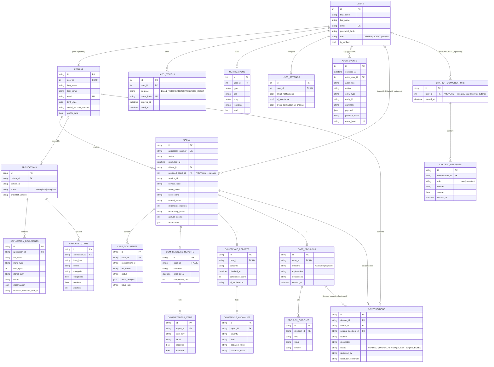

# Schéma de la base de données

Généré à partir des modèles SQLAlchemy (`backend/app/modules/*/models.py`,
enregistrés dans `backend/app/database/models.py`), puis complété par deux
extensions proposées (marquées **NOUVEAU** ci-dessous) qui comblent des trous
réels du produit sans remettre en cause l'architecture existante.

Les sessions de l'assistant de profilage (`features/citizen/profiling`) vivent
en mémoire (TTL, façon Redis) et n'apparaissent pas ici : elles ne sont pas
persistées en base.

## Pourquoi ce schéma et pas une fusion littérale de toutes les idées

- **Une seule table `users` + `role`**, pas de tables `AGENT_CAF`/`ADMIN`
  séparées : le rôle est la seule chose qui distingue un compte, une jointure
  en plus n'ajouterait rien.
- **`applications` (brouillon citoyen) séparée de `cases`** (instantané figé à
  l'instruction) : mutable et immuable ne doivent jamais être la même table.
- **Pas de table `CHECKLIST` intermédiaire** : `checklist_items` pointe
  directement sur `applications`.
- **`assessment` en JSONB sur `cases`**, pas une table à part : c'est un
  agrégat recalculé en bloc, jamais interrogé champ par champ.
- **`fraud_analysis`/`fraud_risk` en colonnes sur `case_documents`**, même
  raison — pas de table `SIGNAL_FRAUDE`.
- **`audit_events` chaîné par hash**, plutôt qu'un simple historique de
  statuts : il capture toute action métier (dossier, contestation, checklist,
  assessment…) et est infalsifiable.

Deux vrais manques ont en revanche été identifiés et ajoutés :

1. **`chatbot_conversations` / `chatbot_messages`** (NOUVEAU) — l'historique du
   chatbot n'est aujourd'hui jamais persisté (`chatbot/service.py` le reçoit
   à chaque requête depuis le frontend et l'oublie ensuite) : aucune reprise
   multi-appareil, aucun audit des échanges possible.
2. **`cases.assigned_agent_id`** (NOUVEAU) — aucune colonne n'assigne
   aujourd'hui un dossier à un agent précis ; `case_decisions.decided_by`
   n'est qu'un nom affiché, pas une clé étrangère.

## Points à noter

- `users` ↔ `citizens` est un 1:1 **optionnel dans les deux sens** : un citoyen
  seedé peut n'avoir aucun compte, un compte peut n'avoir encore aucun profil.
- `cases` est un **instantané figé** à la soumission — il ne suit pas les
  modifications ultérieures de `citizens.profile_data`.
- `original_decision_id` sur `contestations` est en `SET NULL` : une
  redécision ne doit jamais faire disparaître une contestation en cours.
- `audit_events` est **append-only**, chaîné par hash (`previous_hash` →
  `event_hash`) ; `actor_user_id` est en `SET NULL` pour que le journal
  survive à la suppression d'un compte.

## Extensions proposées (non implémentées) — à valider avant migration

| Ajout | Table / colonne | Détail |
|---|---|---|
| Historique du chatbot | `chatbot_conversations`, `chatbot_messages` | `chatbot_conversations.user_id` en `SET NULL` (nullable — le chat anonyme est autorisé, voir `chatbot/router.py` : `get_current_user_optional`). `chatbot_messages.sources` reprend le JSON de citations déjà renvoyé par `ChatbotResponseSchema`. |
| Assignation agent | `cases.assigned_agent_id` | FK nullable vers `users.id`, `ON DELETE SET NULL` — un agent qui quitte ne doit pas bloquer la suppression de son compte ni supprimer les dossiers déjà instruits. |

Volontairement écarté de la proposition initiale : un flag `resolue` par
anomalie (`coherence_anomalies`) — les rapports de cohérence sont recalculés
en bloc à chaque changement de document, pas résolus anomalie par anomalie ;
ajouter ce flag introduirait un état qui pourrait diverger du rapport réel.
